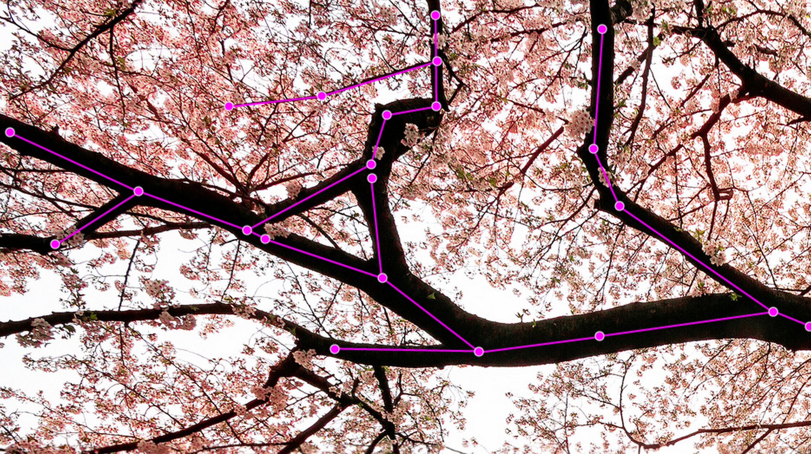

# Sakura, sakura

Today, you're going to make a cherry blossom tree with Javascript.

## Learning Goals ##

  * object oriented modeling in Javascript
  * [immediate mode graphics](http://en.wikipedia.org/wiki/Immediate_mode_%28computer_graphics%29)
    with [canvas](https://developer.mozilla.org/en-US/docs/Web/API/Canvas_API/Tutorial)
  * [turtle graphics](http://en.wikipedia.org/wiki/Turtle_graphics)

## 0. Consider the sakura ##

Let's model a cherry blossom tree from the ground up.

  * A tree has a trunk.
  * The trunk has length and thickness.
  * The trunk grows at some angle to the ground.
  * As we follow the trunk upwards, it splits into branches.
  * Branches also have length and thickness.
  * Branches split off at some angle to their parent branch.
  * Some branches have flowers.

Trees also have a root system, of course, but let's not worry about that for
now. Branches are also sometimes kindof twisty, but let's also not worry about
that for the moment.

Notice a similarity:

  * The trunk has height, thickness, angle, and children (which are `Branch`es)
  * Each `Branch` has length, thickness, angle, and children (also `Branch`es)

So let's simplify our model and say that the trunk is a `Branch`. It still has
length, it just so happens that it's pointing mostly upwards.

Let's also simplify our model and say that each `Branch` terminates where it
splits into children. Sometimes the tree has what appears to be one long branch
with several sprouts:

But we'll model that as several `Branch` instances:

## 1. Create the markup

Write an `index.html` with a `<canvas>` tag and a `<code>` tag in it.
Both should fill the entire window; you'll want to position them with
`position: absolute`, and make their `width` and `height` the size of the window.

Finally, create `sakura.js` and link it to the document with a `<script>` tag.

## 2. Write the model

Let's write two classes for the model: `Sakura` and `Branch`.

The flow is going to work like this: `Sakura` sets up a timer which calls its own `tick`
method. In `Sakura`'s `tick`, it'll call `tick` on its trunk (a `Branch`). In `Branch`'s `tick`,
the branch will grow longer and thicker by a random amount, maybe sprout children, then call
`tick` on all its children.

`Sakura`:
  * has a `trunk` instance variable, which is a `Branch`.
  * has a `tick` method, which calls `tick` on its trunk.
  * [somehow arranges](https://developer.mozilla.org/en-US/docs/Web/API/WindowTimers/setInterval)
    for its `tick` method to get called periodically.  

`Branch`:
  * has `length`, `thickness`, `angle`, and `children` instance variables.
  * has a `tick` method, which grows the branch by a random amount and then calls `tick` on its children.

`World`:
  * has a `tree` instance varaiable, which is a `Sakura`
  * has a `tick` method, which calls `tick` on its `tree`.

`Branch`'s `tick` method is probably the most involved. On every `tick`, a `Branch` should grow a little
bit longer and a little bit thicker. Use
[`Math.random`](https://developer.mozilla.org/en-US/docs/Web/JavaScript/Reference/Global_Objects/Math/random) to have your branches grow by an uneven amount.

Also on every `tick`, your branch should (possibly) sprout a child. You'll again use `Math.random`,
only this time, use it like a die roll. If `Math.random` is less than, I dunno, `0.005`, have
your `Branch`'s `tick` method create a new `Branch` and add it to `children`.

Finally, add some driver code in your HTML page that constructs a `Sakura`.

If you put in some `console.log` statements, you should be able to open your HTML file and
see that stuff is happening. That's not the greatest test, so let's print some more structured
output.

## 3. Print the sakura ##

`SakuraPrinter(tree, node)` takes an instance of `Sakura` and a DOM node where it'll output
a textual representation of the tree's branches.

`SakuraPrinter` should use
[`requestAnimationFrame`](https://developer.mozilla.org/en-US/docs/Web/API/window/requestAnimationFrame)
to ask that the browser call its `draw` method on the next frame.

Unlike `setInterval`, `requestAnimationFrame` requests only a single frame, so you'll also have
to call `requestAnimationFrame` again in `draw`. The pattern looks like this:

    SakuraPrinter.prototype.draw = function () {
      requestAnimationFrame(this.draw);
      // do some drawing
    };

`this` will be undefined unless you explicitly bind it in the constructor:

    function SakuraPrinter(tree, node) {
      // ...other setup...
      this.draw = this.draw.bind(this);
      this.draw();
    }

`SakuraPrinter`'s `draw` method should set the `textContent` of `node`. For each branch, include
its `angle`, `length`, and `thickness`. The output will be more readable if you put every
branch on a new line and indent each branch according to its depth.

You might find that this is easier to do if you write a `toString` method on `Branch` and
maybe `Sakura`.

Finally, add the printer to your driver code. You'll have to pass in the `<code>` tag in
your document. I would give it an `id` and then find it with
[`document.getElementById`](https://developer.mozilla.org/en-US/docs/Web/API/Document/getElementById).

Your output will be more readable if you set the CSS property
[`white-space: pre`](https://developer.mozilla.org/en-US/docs/Web/CSS/white-space)
for the `<code>` element.

## 4. Draw the sakura ##

Now, write a `SakuraSketcher` class. This class works just like `SakuraPrinter`, only
the DOM node it takes must be a `<canvas>`, and it will draw a representation of your cherry
blossom tree.

To draw the lines, we're going to use the
[canvas](https://developer.mozilla.org/en-US/docs/Web/API/Canvas_API/Tutorial)
drawing API.

To figure out where to draw the lines this, we're going to use turtle graphics.
Add `turtle.js` to your HTML.

Turtle graphics work like this; imagine there's a turtle at point (100, 100) on the canvas:

    var t = new Turtle();
    t.pos = [100, 100];
    t.pos; // -> [100, 100]
    t.x; // -> 100
    t.y; // -> 100

This doesn't draw anything. In fact, the turtle never draws anything, she can just move around
and report her position.

The turtle starts facing straight up, towards the top of the screen:

    t.bearing; // -> [0, -1]

`[0, -1]` means that if you ask the turtle to move one step, she'll move by `0` pixels
horizontally and `-1` pixel vertically.

You can ask the turtle to go forward, and say how far:

    t.fwd(5);
    t.pos;  // -> [100, 95]

Your turtle has now moved five pixels up the screen. Yay! You can also tell the turtle to turn.

    t.turnRight(90);
    t.fwd(10);
    t.pos;  // -> [110, 95]

So far, this doesn't seem that useful—we could have figured out the math ourselves.
But you can tell the turtle to turn by any angle:

    t.turnLeft(30);
    t.fwd(5);
    t.pos;  // -> [114.3301270189222, 92.5]

And that's how we'll figure out the endpoints of the branches on our tree.

One last thing a `Turtle` can do is create a copy of itself. It does this with `spawn`:

   var babyTurtle = t.spawn();
   babyTurtle.pos;  // -> [114.3301270189222, 92.5]

This will be useful to you.

Your `SakuraSketcher` class should have a `draw` method, which it should set up to
be called with `requestAnimationFrame`, and a `drawBranch(branch, turtle)` method, which
draws `branch` and all its descendants, using the position of `turtle` as a starting point.

In your constructor, 
  * set the `width` and the `height` of the canvas element to be the `canvas` element's
    `clientWidth` and `clientHeight`. Yes, you have to do this. Yes, it's kindof dumb.
  * get a drawing `context` with `canvas.getContext('2d')`, and save it in a `ctx` instance
    variable. Getting a context might be expensive, and we don't want to do it on
    every frame.

In your `draw` method,
  * clear the canvas
  * create a `Turtle` and position it in the center of the window, at the bottom. Remember
    that y coordinates start with `0` at the *top* of your screen.
  * call `drawBranch` on the tree's trunk.

In your `drawBranch` method,
  * start a new path with `ctx.beginPath()`
  * put the first point of the branch at the turtle's current position. You'll
    use `ctx.moveTo` here.
  * ask the turtle to turn by the branch's angle
  * ask the turtle to walk forward by the branch's length.
  * put the next point of the branch at the turtle's new position. You'll use
    `ctx.lineTo` here.
  * set the width of the line we're about to draw to the branch's thickness by
    setting `ctx.lineWidth`.
  * call `ctx.stroke` to draw the line.
  * draw all the branch's children.

## 5. Tune your tree ##

You may find that your tree doesn't look exactly how you want. It's randomly generated,
of course, so it may never look *exactly* how you want, but you can tune how the tree
grows by changing the constants in your `Branch`'s `tick` method. If your branches are
too stocky, add a bit less `thickness`. If your tree is growing too thick with branches,
make it less likely that a branch will produce a child.

Also, you might notice that if you leave your tree running for even a little while, it
starts to crush your browser. It turns out that having branches generate branches which
themselves generate branches can quickly produce a **lot** of objects. You can help
this state of affairs by having your branches know their `depth` (how would they set this
in the constructor?) and only allowing a branch to produce children if its `depth` is
less than a certain number (7 seems to work ok for me).

Once you're tracking `depth`, you now have another parameter to play with. You could make
the rate at which a branch adds length dependent on its `depth`, for example.

## 6. Blossom your tree ##

Just as every cherry tree is beautiful and unique, I leave the implementation of blossoms
up to you.

## References ##

1. [Sakura photo](https://www.flickr.com/photos/agustinrafaelreyes/8557525252/sizes/l/)
   by [Agustin Rafael Reyes](https://www.flickr.com/photos/agustinrafaelreyes)
   licensed under a
   [Creative Commons Attribution-NonCommercial-ShareAlike license](https://creativecommons.org/licenses/by-nc-sa/2.0/)

